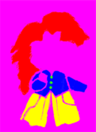
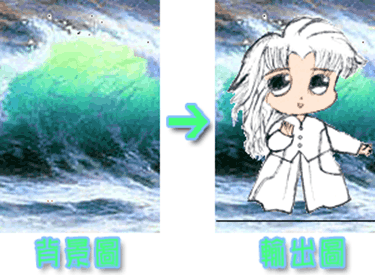
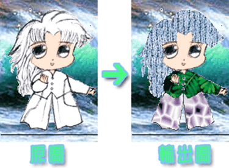
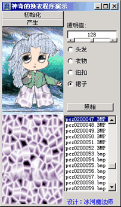

> **摘要**：介绍面向对象语言对图像的基本操作方式及图像的快速渲染方式，颜色的基本运算技巧及控制。

> **关键字**：像素搜索  API渲染  Alpha技术  分解RGB

## 一、引言

随着计算机技术的发展和普及以及电脑游戏的“泛滥”，玩家们的口味越来越高，不再满足于一尘不变的自己的“化身”。他们希望能有更多具有个性化的图片用来作为自己的“电子形象代言人”。这样一来首先就给美工提出了一个大难题——他们不得不画很多的图，甚至为同一个角色同一个造型“换”许多的衣服。这样不仅给美工增加了难度和工作量，而且他们的工作不一定就能带给玩家们满足感。为此，为了满足玩家的个性化口味，我们设计出用尽量少的图片来满足尽量多的需要“个性”的用户。

我们在这里讨论的只是一种理论，所以我们使用最容易理解的Visual Basic来编程做示范，能让我们很容易掌握这种技术。

## 二、对图像进行分析

|  |  |
| -- | -- |

如图，这两幅图便是我们操作的基本图。我们可以看到大量的粉红色区域，那是我们不需要的区域。于是我们把粉红色区域变为背景，再按照右图各个不同颜色的区域换上不同的布料，这位主角便会变得更加美丽出众了。

## 三、基本运作程序——对图像的像素的分析

**输出图像主体**

首先读入图像首像素的颜色，然后便循环搜索图中的每一像素，如果某一像素的颜色与图像首像素的颜色不同，则在背景相应位置输出该像素的颜色，当输出完成后，主角就被输出到背景上去了，如下图。

**输出衣服**

首先确定衣服的哪些部分已被用户确认，并根据这个确定MColor，表示输出部分的标志，然后做循环搜索，如果某一像素的颜色与MColor相同，就表示已进入衣服的该部分了，便对应的输出用户选定的布料的颜色。如图，衣服便换好了。

MColor可设定为red、green、blue、yellow的对应RGB值，

red-255、green-64512、blue-16711680、yellow-64767

## 四、对图像的进一步处理

由上面的处理可以看出来，效果非常不好，原本画有衣服纹路的地方被布料“奋不顾身”的给覆盖了。因此，我们就必须进行一点处理，让“衣服”与“纹路”完美的结合在一起。于是我们想到了Alpha技术，将“衣服”与原图对应像素的颜色进行Alpha处理。当所有像素又重新组合时，图像便处理完成了。如图

Alpha技术：

Alpha技术实质上就是一种透明技术，在电脑图像系统中，通常使用的是RGB调色盘，由红、绿、蓝三原色组成，根据$RGB＝R+256*G+256^2*B$的公式，很容易由RGB色分解为R、G、B三原色。

Alpha技术即先把源像素和目标像素的RGB三原色分量分离，然后把源像素的三原色分量分别乘上Alpha的值，并把目标像素的三原色分量分别乘上Alpha的反值，接下来把结果按对应颜色分量相加，再对最后求得的每个分量结果除以Alpha的最大值（通常这一步都是用移位来完成，这亦是Alpha的最大值为何总是二的幂的原因），最后把三原色分量重新合成为一个像素输出。

## 五、程序的后期制作处理

程序设计中必不可少的一步到了，将程序界面调整一下，让它更加具有人性化，加入一些基本的小功能，例如：直接查看布料，可方便的切换需选择布料的部分，以及可调整Alpha值。切记的是要做一定的错误处理。要知道，用户可不会慢慢地来帮你检查错误。

设计出的程序如图：

## 六、参考源程序：（VB6下编译） 

地址：略

## 七、总结

“换衣”理论有着非常大的发展空间，特别适用于现在还不甚发达的网络世界，使用户得到更大的互动，并能吸引更多的眼光。如果用在游戏世界里，更能节省不少的资源，使游戏的开发周期大大缩短，同时，这个程序一定会让你感到电脑的乐趣。如果你有兴趣或需要源代码，欢迎与我交换意见，给我发EMail(mail:xxx)或者q(qq:xxx)我就行了。

## 参考文献：

1. Microsoft Studio自配 API帮助文件.W32API.TXT.
2. Microsoft MSDN.Visual Basic Help.
