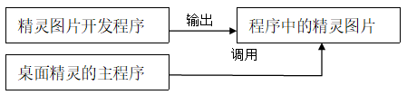
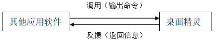

**关键字**：桌面精灵 屏幕保护 插件技术

## 序言

桌面精灵，一种以各种生命为表现形式，使软件更人性化的常能给用户提供便利的软件，这对于现代的新新人类，也许已是陌生而又遥远了，但他们一定不知道这样的小东西曾一度是弄潮儿的至宝，以至于以前的论坛上总有人请别人帮忙做桌面精灵要送给女友，到后来，电脑的功能越来越多，桌面精灵的功能也越显得单一了，直到最后被淘汰掉，但它的思想已经融入到许多软件中去了，例如：Microsoft Office中的助手，Windows2000以上提供的Agent功能，以及一些宠物饲养游戏等。因此我们对新时代的桌面精灵已经有更高的要求了，而现在这正是一片未开发的沃土，现在我们就从它的基本框架，扩展功能，深入探索来展开讨论。

## 基本框架

既然我们需要深入讨论，所以我首先要对它的基本框架有所了解，让我们先来看一下桌面精灵的基本框架：

```cpp
Initialize ()  //初始化部分
{
    将精灵的图片数据载入内存；
    调用API使程序始终居于屏幕顶端；
}
MainLoop ()  //精灵的主循环部分
{
    绘制精灵并使非精灵部分透明；
    获取用户的操作；
    switch(用户的操作)
    {
        case 拖动：
            跟随用户鼠标移动；
            break；
        ……
        其他的响应处理；
        ……
    }
    根据精灵的默认AI执行操作；
}
Exit ()  //结束精灵
{
    释放内存数据；
    退出；
}
```

我们来说明一下桌面精灵的主要运行流程。无论是什么程序，都免不了初始化部分，初始化时，将所有需要的图片载入内存，对加快程序运行有重大的作用，因为一个精灵必然会有许多重复的动作，重复的从硬盘载入会浪费大量的时间。然后就是要使整个程序始终置于屏幕的顶端，也就是要使桌面精灵始终处于可视范围内。进入游戏的主循环部分后，我们要根据精灵的动作绘制相应的图片，并使非精灵部分透明，也就是使精灵能完整而不累赘的显示出来，同时也使精灵更加美观，接下来便会根据用户的操作改变精灵的形态，以及变形趋势，通过最后的简单AI处理后记录下来，等到下一次循环时表现出来。最后当某一要求达到了，或者用户提出了退出的请求，程序释放内存数据并退出。

在后面我们将着重讨论的就是精灵的响应处理部分和AI部分，而且这两者是密不可分的，增加了响应事件就必须增加相应的AI处理，接下来我们还是看一下几种基本的AI处理：

```cpp
AgentAI-Follower ()  //简单的跟随鼠标跑的精灵
{
    获取鼠标位置；
    根据鼠标与当前精灵的距离计算出精灵需要行走的速度；//当距离很远时，需要快跑
    根据精灵的当前动作和动作趋势得到精灵的下一动作；
}
AgentAI-RandomRun ()  //简单的随机跑动的精灵
{
    随机得到一个位置；
    根据随机位置与当前精灵位置的距离计算出精灵需要行走的速度；//当距离很远时，需要快跑
    根据精灵的当前动作和动作趋势得到精灵的下一动作；
}

```

以上我们就用简单的伪代码向大家展示了几种常用的简单的桌面精灵的运行流程和基本结构框架，我们可以看出，在这些代码中可扩展的部分还很多，因此我们继续讨论……


## 扩展功能

我们怀着以人为本的心情来看一个电脑用户是怎么看待桌面精灵的。记得在很早时我也很喜欢用桌面精灵来装饰桌面，但后来发现桌面精灵经常会妨碍我们的正常使用电脑，因为他总是在鼠标旁边晃来晃去，时不时的就会点到它，然后就会影响心情……

不过还好我们又想到了另外一种方案：

```cpp
AgentAI-Escaper ()  //简单的逃离鼠标跑的精灵
{
    获取鼠标与当前精灵的距离；
    if (距离>安全距离)
        根据鼠标与安全距离的距离计算出精灵需要行走的速度；//当距离很远时，需要快跑
    else
        根据鼠标与安全距离的距离计算出精灵需要行走的速度；//当距离很近时，需要快跑
    根据精灵的当前动作和动作趋势得到精灵的下一动作；
}
```

这段程序可以使精灵始终保持在一定的距离里，当我们使鼠标靠近精灵时，精灵就会很快的逃跑，当鼠标远离精灵时，精灵又追了回来，甚至还可以做个鬼脸^-^。

除此之外，我们还可以考虑将桌面精灵与屏幕保护结合起来，通过程序内部来控制，当鼠标停止移动了用户设定的时长，便可以启动该程序，让桌面精灵从各种形态在桌面上跑动，既起到了屏幕保护的作用，又使桌面更加的活跃，我们把这种方案表示出来：

```cpp
AgentAI-ScreenSaver ()  //与屏幕保护结合的精灵
{
    获取当前时间并计算出与上次鼠标移动的时间差；
    if (时间差<用户设定时间)
        按照正常的精灵活动；//即前面提到过的各种运动方式
    else
        按照一定的规则使精灵在桌面上活动；//这种规则通常是要使精灵走遍整个屏幕
    根据精灵的当前动作和动作趋势得到精灵的下一动作；
}
```

以上我们便简单的丰富了桌面精灵的活动，使他变得更加活拨了，当这还不够，我们还可以继续讨论……


## 深入讨论

很多时候，我们觉得这个桌面精灵除了使桌面变得活跃些了外，似乎没有其他作用，却占了极大的系统资源（相对于它的作用），因此我们可以试着给他增加一些活力，但由现有的框架来看，除了可以让精灵的动作丰富起来之外，实在想不出什么更好的东西，其实不然，现在网络已经是如此的普及了，我们现在甚至可以让我们的桌面精灵连上网去，这样就又增加了几分实用了，现在我们就试着完成这样一个简单的任务：让精灵能即时报道一个论坛的最新信息，使他成为一个论坛精灵，我们先来看他的程序流程：

```cpp
Login ()  //登陆并初始化部分
{
    将精灵的图片数据载入内存；
    调用API使程序始终居于屏幕顶端；
    获取用户名和密码并发至论坛服务器；
    等待服务器的反馈；
    if (同意进入)
        进入主程序；
    else
        提示错误并重新登入；
}

MainLoop ()  //精灵的主循环部分
{
    绘制精灵并使非精灵部分透明；
    获取用户的操作；
    if (可本地操作)
        进行本地操作；
    else
    {
        将操作发送至服务器；
        等待服务器的反馈；
        switch (反馈)
        {
            case 新贴：
                使精灵作相应的动作，告诉用户有新贴；//用户可定义只接受哪一类信息
                break；
            ……
            其他的反馈处理；
            ……
        }
    }
    根据精灵的默认AI执行操作；
}

Exit ()  //结束精灵
{
    发送离开请求给服务器；
    释放内存数据；
    退出；
}

```

从以上的程序中可以看出，整个程序与基本框架相似，仅仅是加入了网络连接部分，由此我们可以轻易通过基本框架来扩展功能。
如果精灵的图片、动作始终是重复的那几个，难免不会有厌烦感，但对于一个独立的软件开发者来说，也不可能有如此多的精力来开发多个精灵的图片，因此我们便要做好程序的接口，以便其他人，甚至是用户，可以自行开发精灵。



就像上图中的一样，只要使程序分成了以上的几个部分，那么整个程序的扩展性就得到了极大的提高，可以很容易的是整个程序变得丰富多彩。
在实际应用中，如果你所提供的桌面精灵没有非常实际的用途，那么通常不会有人专门来为你的程序作精灵图片，但我们还可以有另外一种策略，即将自己的程序作为一个插件提供给别人，如下图中的策略：



由此便可以很容易使桌面精灵得到广泛的应用。

## 总结

本文仅是从实现这类程序的观点出发，提供了思路和流程，我们可以顺着这个思路思考下去，加入更多的新元素、新功能，融合更多的优点，根据基本框架将整个程序完善丰富起来，甚至可以考虑根据系统结构进行优化，使程序占用的系统资源大大的降低。
