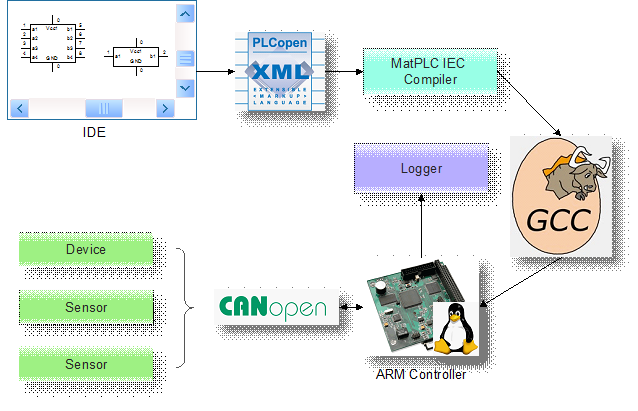

**作者：梁爽**

## 引言

### 背景

集成工控开发平台是由一系列的软件和硬件组成的，用到了PLC、嵌入式操作系统、相关编程语言、IDE及HMI等部分。集成工控开发平台作为工业自动化生产开发新型智能设备控制系统的重要平台，具有极其重要的意义。同时，由于其开发难度高和成本高，现有此类平台并不多，完成该平台的开发有助于巩固公司竞争力及后续各种工业自动化产品的快速产出。

### 标准

- IEC 61131
- IEC 61499
- PLCOpen
- Modbus
- Ethernet(TCP/IP)
- OPC

### 定义

- PLC: Programmable Logic Controller
- OPC: OLE for Process Control
- IDE: Integrated Development Environment
- HMI: Human Machine Interface
- CAN: Controller Area Network

## 目标及条件

### 目标

制作一套满足基本工业标准的集成工控开发平台，努力提高系统的易用性，略过现有标准中陈旧和可用性相对较小的部分，开发新的可让工程人员更高效产出的功能。

### 条件、假设及限制

- 遵循现有的所有工业标准，并进行适当的删减和增添，但不能改动其中任意部分
- 此方案中的阶段划分是不考虑人力安排的

## 现有系统

### KW系统

科维公司产品，专门面向工业自动化，其IDE软件MULTIPROG有及其丰富的功能和良好的名声。其软件及嵌入式系统设计非常灵活标准，可以支持大量的各品牌硬件设备。

### Beremiz

唯一一款开源的，且同时是专门面向工业自动化的产品，其IDE也非常好的支持了相关标准，但使用上相较KW略微欠缺，且支持的硬件设备相对有限，但其独特的架构设计使其甚至可以直接运行于无操作系统的硬件上。

### EPKS

Honeywell的旗舰产品，大家都懂，无需多说。简言之就是功能强大但不够标准化，支持的硬件设备相对较为单一。

### Cypress-PSoC

硬件结构上使用了ARM+FPGA的方案，用SoC的方式来集成接口资源，可使接口资源最大化的利用，且速度效率极高，但其IDE软件用起来比较吃力，且没有符合相关标准，硬件也是使用自己公司生产的硬件。

## 建议的新系统

### 横向对比

请见下页表格

|            | 项目             | 新系统                              | EPKSR430              | KW系统                        | Beremiz                    | Cypress-PSoC5         |
| ---        | ---              | ---                                 | ---                   | ---                           | ---                        | ---                   |
| 编辑器     | 名称             | 未定                                | Control Builder       | MULTIPROG                     | PLCOpen Editor             | PSoC Creator          |
|            | 支持LD           | ×                                   | ×                     | √                             | √                          | ×                     |
|            | 支持FBD          | √                                   | 类似的                | √                             | √                          | 类似的                |
|            | 支持IL           | ×                                   | ×                     | √                             | √                          | ×                     |
|            | 支持ST           | √                                   | ×                     | √                             | √                          | ×                     |
|            | 支持SFC          | ×                                   | 类似的                | √                             | √                          | ×                     |
|            | 其他语言         | C                                   | ×                     | C\#/VB.Net                    | C                          | C                     |
|            | 支持PLCOpenXML   | √                                   | ×                     | √                             | √                          | ×                     |
| 编译器     | 名称             | MatPLC 's IEC compiler & C compiler | Control Library       | MULTIPROG                     | MatPLC 's IEC compiler & ? | Keil PK51/ Sourcery G |
|            | 编译方向         | IEC-&gt;ANSI-C-&gt;Binary           | ERDB-&gt;Param List   | IEC-&gt;Binary                | IEC-&gt;ANSI-C-&gt;Binary  | ()-&gt;C-&gt;Binary   |
| 运行时系统 | 名称             | 未定                                | C300                  | ProConOS                      | CANFestival                | Bootloader            |
|            | 支持系统         | Linux                               | Green Hill            | Linux/ WinCE/ VxWorks/ …      | Linux/ WinCE/ µC           | 自有系统              |
|            | 支持芯片         | Specific ARM                        | Green Hill            | ARM系列                       | CAN 控制器                 | ARM Cortex-M3         |
|            | 硬件架构         | ARM                                 | ARM+FPGA              | \*ARM                         | ARM/AVR                    | FPGA+ARM              |
|            | 支持分布         | √                                   | √                     | ?                             | √                          | ×                     |
| 数据       | 名称             | Modbus                              | ControlNet/ DeviceNet | OPC Server                    | CANOpen                    | N/A                   |
|            | 上下位机通信内容 | 程序/参数                           | 参数                  | ?                             | ?                          | ?                     |
|            | 收集频率         | 10ms                                | ?                     | ?                             | ?                          | ?                     |
| 通信       | 名称             | Modbus                              | ControlNet            | HilscherCIF/ INTERBUS/ Modbus | CANOpen                    | 专用的                |
| HMI        | 名称             | 未定                                | HMI Builder           | ProVisIT/MicroVisIT           | SVGUI                      | N/A                   |
|            | 架构             | HTML5+WebSocket                     | HTML+VBScript         | Java-Applet(定制的VBS)        | SVG                        | N/A                   |
| 其他       | 授权             | 商业                                | 商业                  | 商业                          | LGPL                       | 商业                  |

?代表尚未找到合适途径确认的信息

### 新功能

#### 云功能库功能

工程师若将该IDE软件连接至我们的云功能库，将可以获取到最新的功能块，可以下载并快速的集成至他自己的工程中去。

工程师可以存储有限的自己的功能块在云功能库上，可以方便未来使用，同时也可以共享自己的功能块，当然也可以有公司内部共享之类的功能。

#### 超大数量监控点/控制点

设计上使得系统易于扩展，且每一个控制器直接可连接的监控点就达到一个较大的数量级（这个难度大，就先写着看看吧）

#### 毫秒级数据采集监控

为了使数据采集及时，应加快数据采集平度，而存储部分将会设计更有效的数据结构来存储数据，使得数据不用占用大量的空间（难度一般吧，这个上面说不定还能开发些专利出来）

#### 大数据的精确组织及分析

大量数据的收集及分析是更新优化当前生产流程的重要信息，故需要适当的展现方式将数据展现出来，使得分析人员可以进行进一步优化决策。

#### 人工智能调节

（这是一个非常庞大复杂的功能，至少到第五期才能实现，晚点再删除掉。）

完成该功能的重要前提如下：

- 数据反馈及时；
- 大量的数字化数据可供神经网络学习，遗传算法变异；
- 各个执行设备设定好严格的安全执行区间；
- 智能控制器因其权限较大，应与普通控制器一样在防火墙内部；

在有以上几项前提条件下，可使用上位机连接至控制器，直接控制设备并根据传感器的及时获得的反馈信息更新迭代其动态模型。

### 系统架构

一期功能架构图（简版）

### 阶段目标

需要注意的是，该阶段目标是不考虑具体人力安排，而是按照人力资源充沛的情况下，任务本身可以尽量并行和同时完成的要求来安排的。

#### 第一阶段

第一阶段肩负着整个项目重要的探路工作，所以尽量可能的定义出各部分之间的接口，使其各部分均能尽快的进入到自身的测试中去。

技术层面，完成整套系统如下基本流程的搭建：

- 读取PLCOpenXML数据并生成ANSI-C代码（使用开源代码MatPLC 's IEC compiler改造）
- 将ANSI-C代码生成二进制代码（使用GNU compiler）
- 编写固件相关代码（通信代码参考CanFestival，库函数仅实现加减乘除，IO接口函数需实现）
- 编写监听CAN网络的调试用记录程序

需求层面，这一阶段，需同时准备IDE编辑器和HMI编辑器的需求原型设计，并确定最终需要在固件中实现的所有基本库函数功能列表。

这一阶段结束后，我们将会看到一套完整的从上位机代码下装到控制器执行，控制设备并获取传感器信息回传至上位机的流程。

#### 第二阶段

完善上一阶段的功能，并增加如下功能点：

- 开发IDE编辑器（含FBD/ST语言编辑功能，能增删改查PLCOpenXML格式文件）
- 编写固件相关代码中的协助远程调试的代码
- 编写固件相关代码中的基本库函数
- 修改ANSI-C代码生成二进制代码部分，使其可以嵌入远程调试和日志等相关程序
- 编写Modbus协议并进行通讯测试
- HMI界面代码设计及编辑器的开发
- 硬件设备的软件模拟器

需求层面，同时需要进行云功能库的需求原型设计，大数据的采集分析中心的需求原型设计。

这一阶段结束后我们将看到一套完整的从编辑器中的组态下装至控制器执行，控制设备并获取传感器信息回传至上位机中的HMI界面中展示出来的流程，同时，在IDE编辑器中可以使用的基本库函数也已经准备就绪，并可通过IDE进行基本的远程调试（看到变量和寄存器中的值和内容）

#### 第三阶段

本阶段完全用于完善上一阶段的所有功能点，并进行联合测试。

同时开始开发本系统真正区别于其他系统的特色功能：

- 云功能库开发
- 大数据的采集分析中心

这一阶段结束后我们将会看到在上一阶段已经能够看到的完整流程，不过功能将会更加完全，并且能很好的支持组态调试。

#### 另一种第三阶段

前几阶段为了快速开发，只选择了ARM一个芯片，使得该系统属于SoftPLC范畴，如果需要提高效率和速度，可以选择多配备一个FPGA芯片。同时为了提高稳定性，可以考虑配备双ARM芯片，单块芯片出现异常时进行切换并恢复异常芯片内容。

按此方案，系统的硬件水平将会更大的提高。

## 技术可行性

第一阶段可以用各种开源程序来降低风险，使得原型得以快速的完成开发。主要技术难点应该有以下几点：

- 远程调试
- （后面再补充）

## 成本可行性

为完成第一阶段的开发，需要以下类型工程师及相应时间：

| 人员       | 工作                                                                                                    | 时间          |
| ---        | ---                                                                                                     | ---           |
| 电路工程师 | ARM芯片外围电路设计 电路板设计 基本连接IO卡件接口设计                                         | 3人月         |
| 固件工程师 | 上位机与控制器通信功能 基本库函数（加减乘除） IO接口函数                                      | 3人月         |
| 软件工程师 | 读取PLCOpenXML数据并生成ANSI-C代码 将ANSI-C代码生成二进制代码 编写监听CAN网络的调试用记录程序 | 3人月         |
| 需求工程师 | IDE编辑器需求原型设计 HMI编辑器需求原型设计 固件中所需要实现的基本库函数                      | 3人月         |
| 架构工程师 | 确定各部分接口细节 与需求工程师确定相应需求的技术可行性 确定下一阶段将会使用的架构设计        | 3人月         |
| 打杂工程师 | 文档编写 项目进度控制 杂事（尤其是突发杂事）的处理、过滤                                      | 3人月（兼职） |

后续阶段的估算将会根据第一阶段的时间进行细节调整，获得更加准确的投资数据。需要注意的是，第一阶段完成后，任务将可以更加细分，使得更多工程师可以加入到开发，使进度能更快更好的完成。

## 其他可行性研究

### 版权可行性

LGPL在不使用静态连接而用动态连接时，使用部分不用继承LGPL协议，即不用开源，故无使用上的版权风险（诶，也不知道这样说对不对。）
