人工智能和机器学习之类的都是大门类，包含众多的下属细节，今天探讨的仅为生成式对抗网络(Generative Adversarial Networks)，这个算法在短短不足三年时间就在内容自动生成领域做出了巨大贡献。

## 一、GAN现在能做什么？
1、涂鸦

你只要涂鸦，心想的场景就会被自动计算出来，比如我们只要画两笔绿色，草原就出来了。 [^IED]

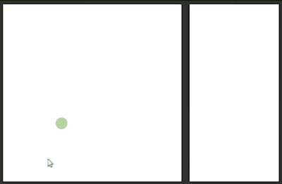

我们再继续加上山脉的轮廓和雪山的白色。

这个也可以被用到类似于鞋包的设计上。

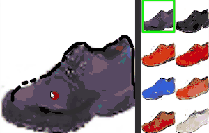

依旧是涂鸦，

不过生成是梵高风格的图片[^NDD]

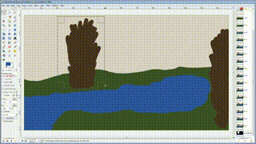

甚至可以使用涂鸦来快速换妆[^PED]

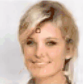

还可以对线稿上色，只需要简单的涂鸦，左图是输入，右图为程序的运行的结果[^CLA]

2、生成

在观看接下来的生成图片时，请一定带入以下**几点前提**：

* 所有图片都起始于一个**随机数**，所以一般生成开始时都能看到噪点一般的图片；
* 所有训练过程是**无人参与**，甚至对训练数据的分类都是没有的；
* 该算法的最初论文发表于**2014年**中，即发展至今也不足三年；

可以生成花朵[^FLR]

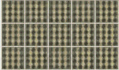

可以生成女孩的脸[^GLF]

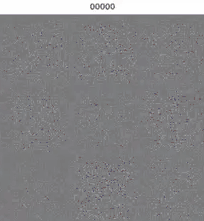

可以生成装修的房屋平面图[^LOT]

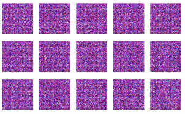

可以生成口袋妖怪的图片[^PKM]

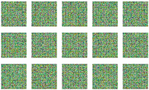

甚至可以根据输入的文字描述来生成对应的图片[^TIS]

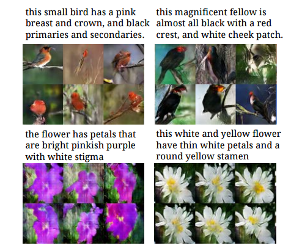

3、补全

可以将图片中不完整的部分自动生成出来，如下图，中间的脸部区域是被删除掉了，由算法重新生成了不完整的部分[^ICT]

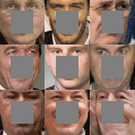

4、优化实例

这里展示一个典型的优化实例，但由于该例官方并未公布其算法原理，列在这里仅仅为了说明该算法可以胜任该类问题。

> 据说这是世界上第一台由机器学习自己创作的赛车

第一步，工程师们将传感器部署在现在成熟的赛车框架各个部位，如下图：[^HKR]

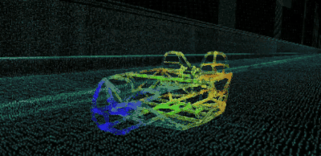

第二步，通过人工智能的计算，设计出了以下这个绝对无法由人类设计出来的框架结构，做到了质量最轻而又结实的效果。 当然要制造出这样的框架就得靠3D打印这个同样前沿的技术。

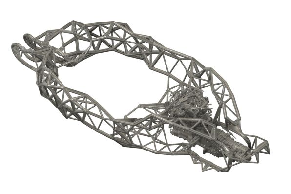

最后一步，设计师再为这个赛车设计一个酷炫的外壳。

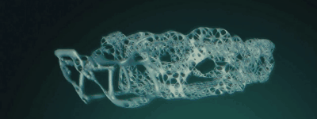

## 二、基本原理

我这里只最简单的说一下生成式对抗网络的生成过程。

如下图一个单点的简单系统。[^SGA]

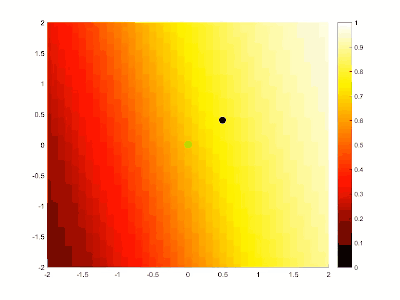

绿色圆点代表通过训练得到的目标特征，而深色圆点则是随机生成的起始位置，随着计算的深入，不断调整网络中的参数去拟合目标特征，最终做到符合目标特征。

理解了这个简单的实例，我们就来看这个稍微复杂一点的实例：[^MGA]

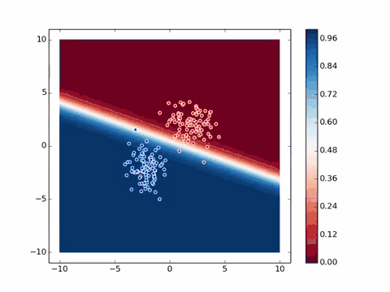

蓝色圆点代表通过训练后得到的目标特征群，红色圆点则是随机生成，同样随着计算的进行，不断的调整了网络中的参数去拟合目标特征，找到标准偏差最小的位置。有可能你会问为什么不让圆点完全重合，那是为了生成图片的随机性和多样性，若完全重合了，那所有图片都是一样的了。

## 三、实施GAN需要什么样的投入

为什么人工智能在最近几年得到如此快速的发展，这都得归功于硬件的快速发展以及软件平台的完善，NVidia的CUDA平台的成熟，使得开发变得更加简单和可控，另外还有开源神经网络TensorFlow和Torch等一系列基础平台的成熟，使得后来者可以站在巨人的肩膀上继续前行。

对于个人，体验生成式对抗网络的最简易配置就是配备最新NVidia显卡的现代电脑。速度嘛，这里有个数据可以参考：

> 50000张的图片集在8块Titan（NVidia的最高端显卡，某东价10000+RMB）上进行训练，需要5天[^SOG]

注：不同的具体算法，速度和精度千差万别，以上数据只能说明当前存在这样的算法，而做机器学习的同学必然也会遇到需要验证以上算法情形，故该速度依旧有重要的参考价值。

软件方面，当前最方便体验的是直接在机器上安装Linux操作系统，因为Windows虚拟机普遍为解决显卡共享问题而有显卡接口层，使得调用CUDA暂时不可能，只有非虚拟机中的原生Linux操作系统才能直接访问显卡执行CUDA命令，而Linux下的核心虚拟机无此限制，故Docker可以使用。

## 四、机器学习在工业领域的潜在应用

目前为止，网络上还无法找到明确的机器学习生成网络在工业领域的应用，但是我们可以想象，使用这样的机器学习生成网络技术，我们能做到以下：

* 自动生成厂房及管路设计图
* 自动生成组态逻辑

要做到这些我们的行业都还缺点什么呢？

* 人工智能及机器学习的基础人才和硬件环境
* 由过去经验总结出来的整理好的可行的厂房及管路设计图，和组态逻辑
* 确保正确的验证逻辑

这一切都需要拥有这些经验的公司，擅长分析的数据专家，擅长整理数据和逻辑缜密的工程师一起来完成。

## 参考文献
[^LOT]: DCGAN Japanese floor plan https://www.youtube.com/watch?v=SwvM7f5CUjs
[^PKM]: DCGAN with Pokemon GO https://www.youtube.com/watch?v=rs3aI7bACGc
[^GLF]: Generating faces by DCGAN https://www.youtube.com/watch?v=Svk0SxyNdr8
[^MGA]: Generative Adversarial Example https://www.youtube.com/watch?v=CILzNj2MP3s
[^HKR]: Hack Rod https://www.youtube.com/watch?v=0ebsf2BMYm8&t=12s
[^IED]: Image Editing with Generative Adversarial Networks https://www.youtube.com/watch?v=pqkpIfu36Os&t=126s
[^SGA]: Simple Generative Adversarial Network (GAN) https://www.youtube.com/watch?v=ebMei6bYeWw
[^SOG]: https://www.zhihu.com/question/54414709
[^FLR]: WGAN flowers https://www.youtube.com/watch?v=e50WBRManWU
[^PED]: Neural Photo Editing with Introspective Adversarial Networks https://www.youtube.com/watch?v=FDELBFSeqQs
[^CLA]: Automatic coloring and shading of manga-style lineart http://kvfrans.com/coloring-and-shading-line-art-automatically-through-conditional-gans/
[^ICT]: Image Completion with Deep Learning in TensorFlow https://github.com/bamos/dcgan-completion.tensorflow
[^TIS]: Generative Adversarial Text to Image Synthesis https://arxiv.org/pdf/1605.05396v2.pdf
[^NDD]: Neural doodle https://github.com/alexjc/neural-doodle
