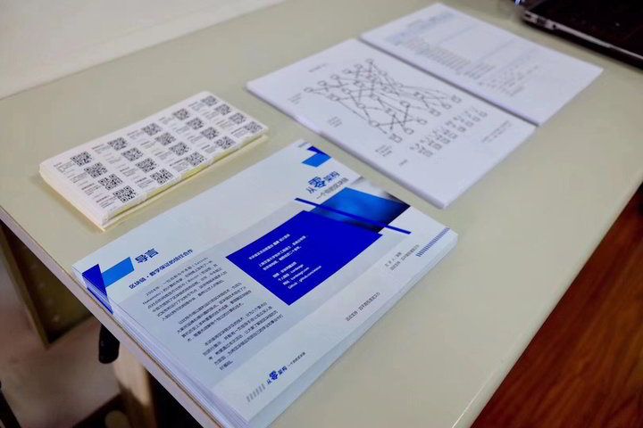

今天下午，我在四平路社区与一群小朋友们分享了区块链的知识。通过游戏的方式，我们一起探索了区块链的世界。
其中，小朋友们最喜欢的是“工作量证明”和“数字签名”这两个游戏，场面一度非常热闹。他们的想象力令人惊叹，无论是什么话题都能接上去。

在“数字签名”的游戏中，我们进行了一次实际的练习。

在“工作量证明”的游戏中，我们邀请了几组小朋友扮演矿工，通过扔色子的方式来模拟工作量。每当扔出6点，就可以添加一个区块，最终，不同队伍（颜色）的区块形成了一条完整的区块链。

我们还为小朋友们准备了一款特别的区块链架构设计贴纸。这款贴纸游戏旨在帮助小朋友们以一种趣味的方式理解区块链项目的构成要素。通过这个游戏，他们可以直观地了解到，一个完整的区块链项目需要涵盖哪些关键的考量因素。

当问及“什么是区块链？”的时候，他们用自己的语言解释说：“就是一个一个的区块，链接着下来。”这个解释简单直接，易于小朋友理解。

通过这次活动，小朋友们不仅了解了区块链的基本概念，还通过亲身参与，体验了区块链的运作过程。

相信对小朋友们来说，这会是一次非常有意义的学习体验。

