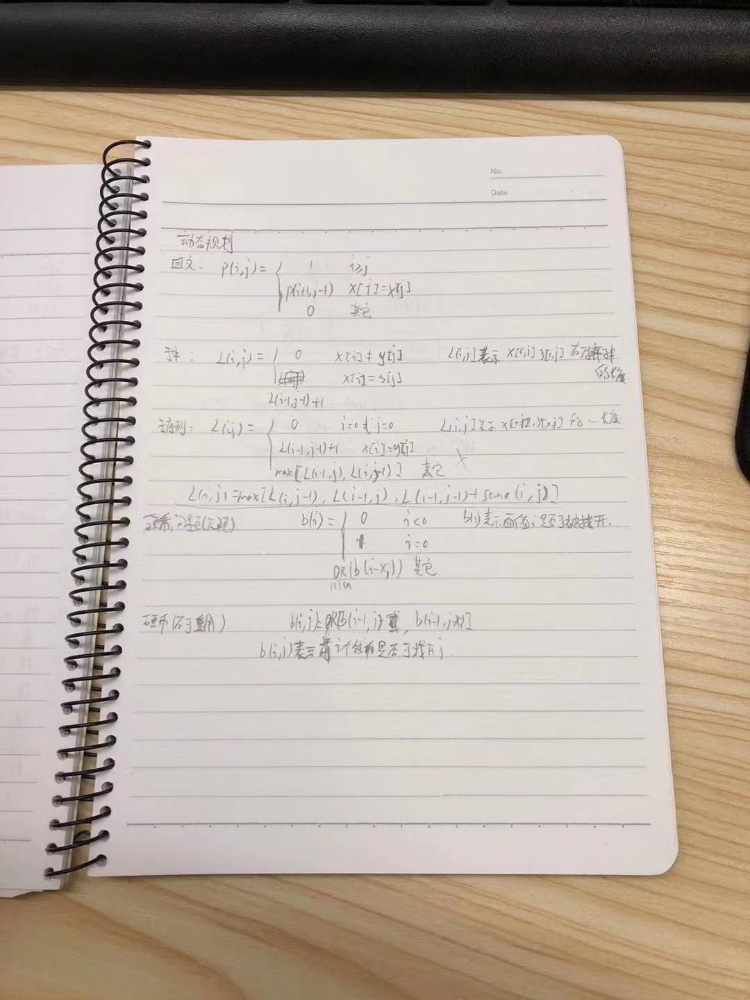
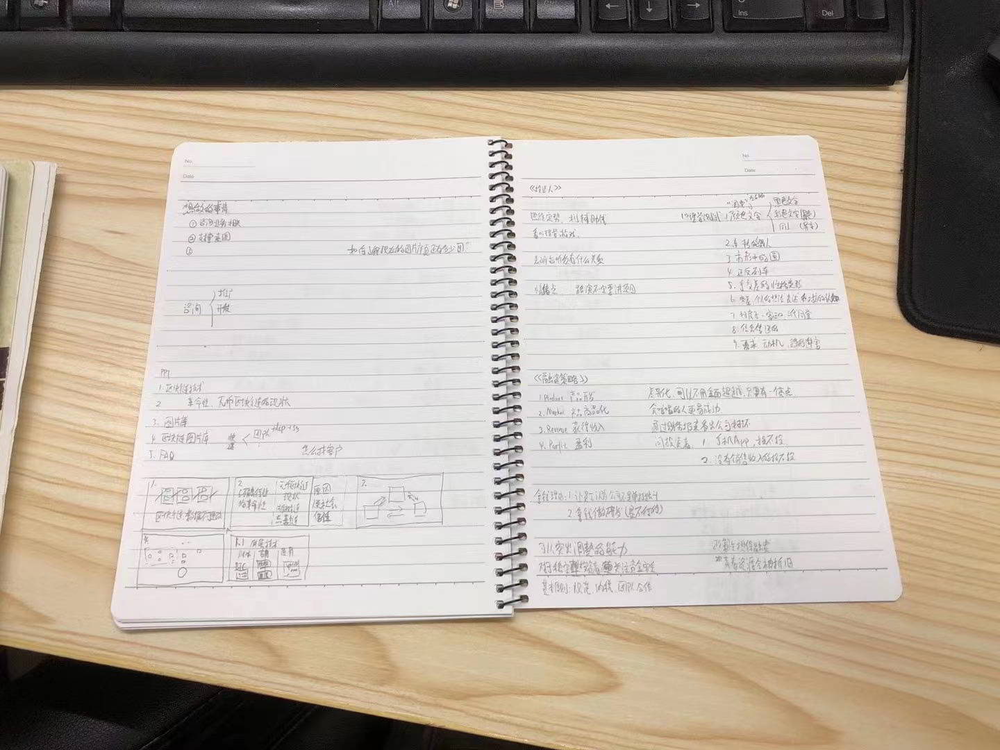
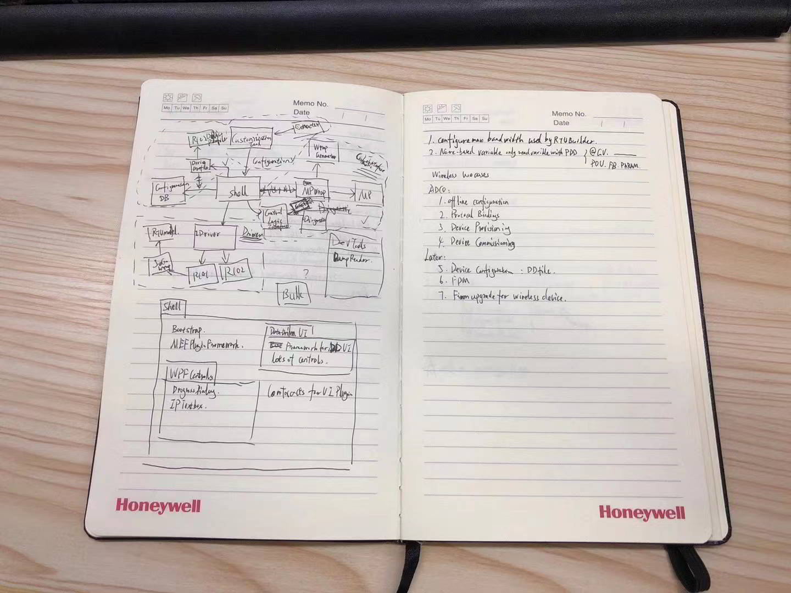
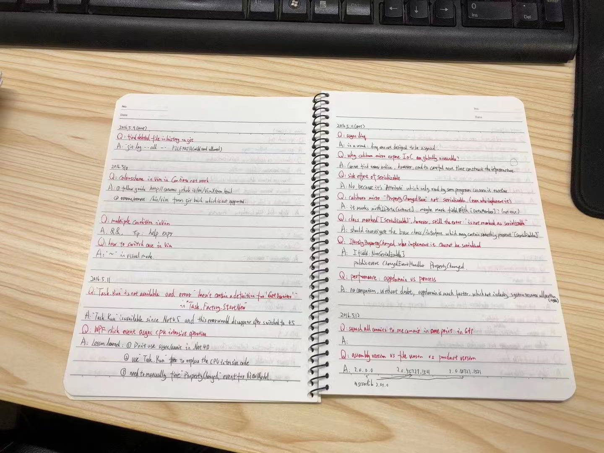
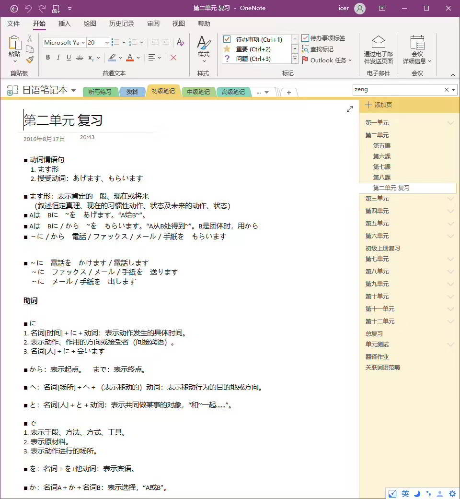
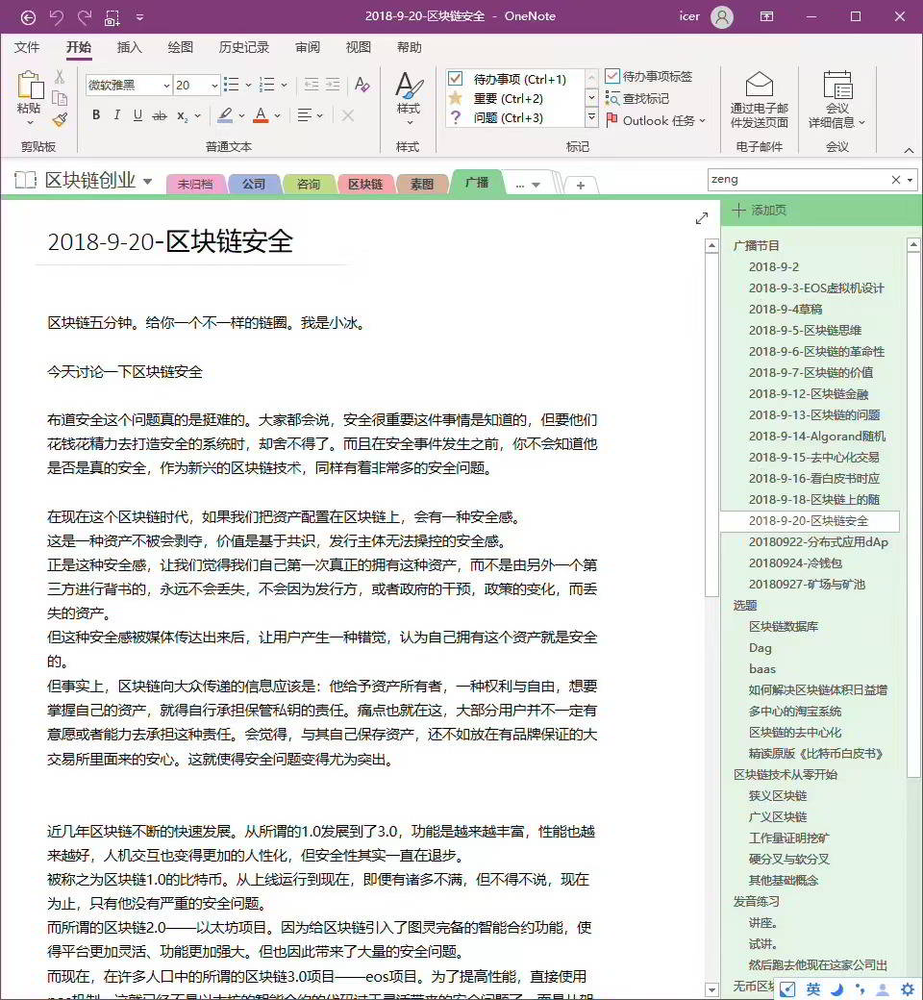
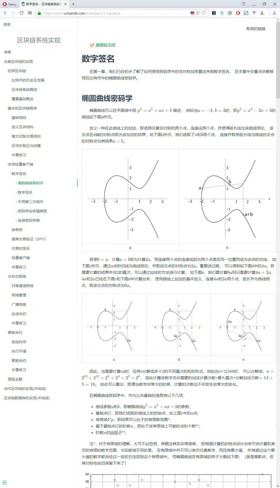

今天，我在浏览导师的朋友圈时，有一种醍醐灌顶的感觉。

以前，我一直以为我已经拥有了良好的笔记习惯，如课上做笔记，课后补充笔记，以及一个阶段结束后的笔记整理。然而，今天我意识到，我忽略了预习笔记这一重要环节。

我曾认为，预习只需要在书上做一些标记，勾画出自己不懂的重点，然后带着问题去听课就足够了。然而，我现在意识到，只有做了预习笔记，我们才能真正有效地理解课程结构，从而更好地吸收和理解知识。这个方法值得我们深入学习和实践。

当我回过头去看自己的笔记时，我发现它们并不像我印象中的那么好。这提示我，我需要重新审视和改进我的笔记方法，特别是在预习阶段。预习笔记不仅可以帮助我更好地理解和吸收课程内容，而且还可以提高我的学习效率。

