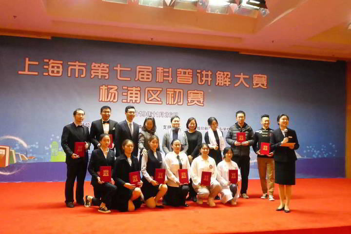

今天，我有幸参加了上海市第七届科普讲解大赛杨浦区初赛。在这次大赛中，我向大家讲解了区块链的秘密，希望能让更多人理解和接触到这项革命性的技术。

我非常荣幸地进入了前10，并被授予了“杨浦区优秀科普大使”的称号。这一切的成就都离不开各位老师和朋友们的支持和鼓励，我在此表示深深的感谢。

在比赛中，我尽我所能解释区块链的工作原理和应用，希望能帮助更多的人理解这项技术，并看到其未来的可能性。

- [新闻链接](https://mp.weixin.qq.com/s/_52V2BfQ5TlBOApilpKM3g)