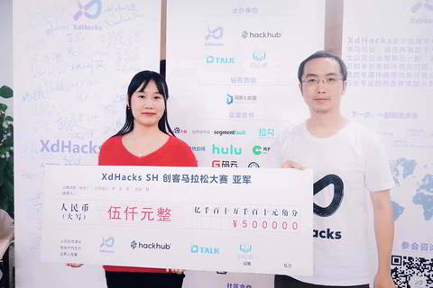

周末参加xdHack活动，做了个视频摘要快速提取系统，还是传统的图片模式识别算法（现在好像统称人工智能了）做的。
很荣幸地获得了二等奖。

这个智能视频摘要系统的创意源于我们在整理区块链技术资料时遇到的问题。我们发现有大量的技术视频需要观看和理解，这消耗了我们大量的时间。因此，我们想要开发一个可以快速转化视频为图文的工具，以便我们能够快速地理解和掌握视频中的内容。

在讨论后，我们的队伍认为这个工具也非常适合新媒体编辑使用，因此我们将其定位为一个可以将视频快速实时转化为图/文/动图/小视频的工具，以适应不同平台的传播需要。

这个想法在比赛前两天突然产生，我们迅速做出决定并开始开发。在比赛当天，我的队友甚至带着三脚架和相机，录制了现场的视频作为我们的实验样本。我最初只是想开发一个自己用着顺手的工具，没想到这个系统受到了大家的热烈欢迎，最后我们赢得了二等奖。

这次的经历让我认识到，我们需要更多地听取大家的需求，以便我们能够开发出更符合大家需求的工具。我期待在未来的日子里，能够继续开发出更多有用的工具来满足大家的需求。

**朋友圈评价：**

- 朋友：你用这个项目创业，说不定比区块链还更能够成功
- 朋友：我们今年发了篇视频summary的论文，采用的GAN
- 梁爽：怎么你们都在劝我回归图像识别领域,那我的区块链的信仰呢
- 朋友：托瓦茨与git好像也是这么个剧情
- 朋友：爽吧不经意就弄出出个需求导向的好产品
- 朋友：将一张图片分解成七八块就成区块链了
- 朋友：区块链是一种工具，做实际的应用，可能有时候更有价值

- [新闻链接](https://mp.weixin.qq.com/s/TNizB0jmKyuu5HwLiwFVVQ)

PS: 后来这个系统变成了[剪刀兔](../../projects/2020/editool/)这个产品。
