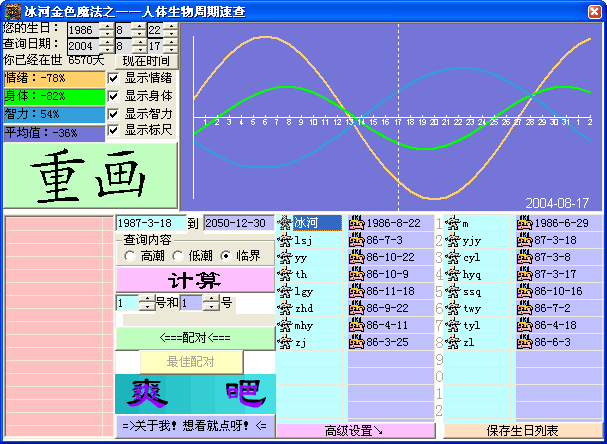

**简介**：根据周期理论，将人的生物周期曲线直观的显示出来，通过内外调节，可以使考生在考试期间的智力、情绪、体力达到最佳状态。此软件为绿色软件，便于随身携带，可即时查询，人物列表可以很容易的使你查看一个集体的情况。

**技术要点**：本程序拥有一个“超级配对”功能，可以计算出两个人之间的搭配程度，以及他们最搭配的日期，均使用了优化后的算法。

**自我评价**：这是我初二时制作的，当时正好学了函数，突然想到了生物周期，便翻阅了许多资料，确认了各自的周期后，试着编了这个软件，这后，每到考试之前，便拿出来查一下，感觉还是很实用。当然，多用户功能使我还可以帮同学查。
