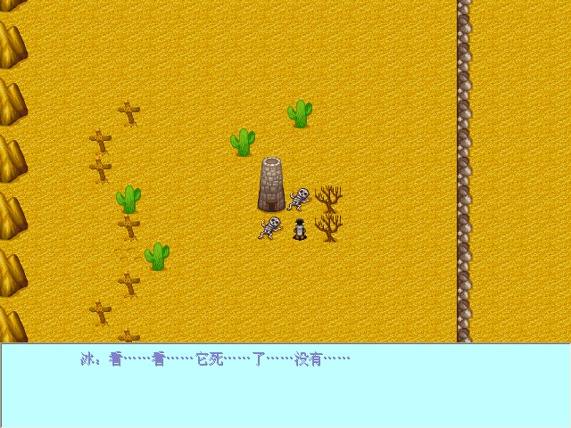
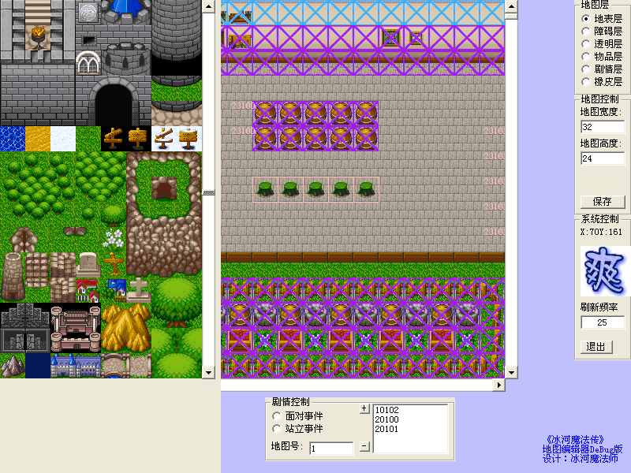

2002年，我的第一款图形化游戏，VB6

**简介**：玩家可以根据自己的想法，设计出自己的剧情来，通过地图编辑器可以设计出丰富多样的地图，通过编写脚本，设计人物，以及对话，一个充满个性的游戏便诞生了。

**自我评价**：这是我初三毕业后的暑假时花一个星期设计制作的，当时感觉做得最好的是地图编辑器，拥有了地图编辑器应该有的所有功能了，在操作上也作了优化，用起来比较顺手。主程序本来还设计了战斗系统的，但是由于开学后，没时间调试了，所以最终版本里没有战斗部份。算是我制作游戏的一个开端了。

**获得评价**：该作品同时也是我的电子杂志《游戏思想与制作》的附属品，当时在业余游戏业掀起了一潮制作游戏热，不过有很多的工作组也在当中夭折了，为了不让我的游戏出现同样的命运，我极力宣传用电子杂志作为游戏制作的坚强后盾，不但能使技术透明化，而且还能使更多的人才加入进来。

---
#### 精选评论

> 黄晓愉2012-07-29 22:42
>
>  这个我好像玩过

> 梁爽2012-07-29 22:44
>
> 回复黄晓愉：哈哈，那你一定是这个游戏少有的几个玩家啦。。
