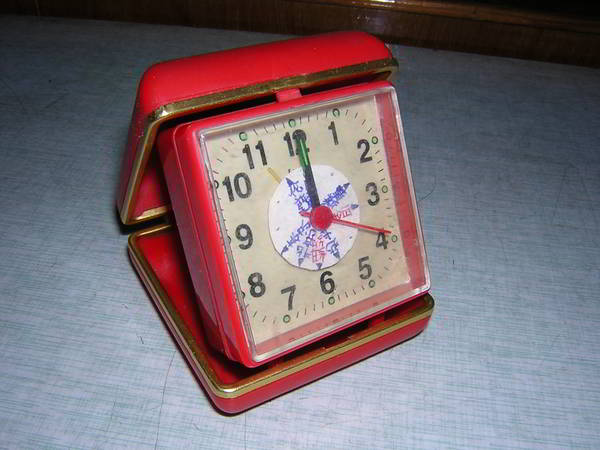

**说明**：时钟已经很普及了，但是要想在一个时钟里看到许多地区的时间，似乎不太常见，这个时钟便是因此而产生的，表盘上印有各个地区的名称，可以一目了然的观看各国家的时间，红色地区名称的表示与蓝色的地区的白天黑夜正好相反，因此全世界的任意一个角落的时间都可以用这个表盘表示出来了，而且这种时钟的成本十分的低廉，自己都可以动手DIY一个。

**创意来源**：记得有一次出去旅游，看到旅馆里挂了一排时钟，我便奇怪的问妈妈，为什么要有这么多的时钟呢，当我知道这是为了方便外国游客看时间时，我天真地说，把那些时针重叠在一起不就方便多了，省去了好大的空间。不过时间很快将这些抹去，直到四年级开始学习社会，课本上出现了时区的概念，我觉得我有能力把这个小时钟真的想法做出来了，于是几个小时的苦战，这个世界时钟便制造出来了，就是大家现在看到的这个样子。

**后记**：事隔多年，直到高一时，听说有位同志把这样的时钟申请了专利，不知道这有必要吗，我倒是认为可能已经有很多做出这种东西的人了吧？

**关于我的发明**：小时候无聊的我，很擅长于手工，因此做了不少有趣的小东西，比如说学着科幻片（当时以为是真的）里做报警系统，当然最后的结果是半夜三更莫名其妙的叫了，还有为了逃避父母的侦查，做得有灯光的文件夹，可以在被子里舒舒服服的看书，更有意思的是学着动画片里的，做了一个喷气式木制小车，而动力也使用动画片里所画的气球，当然最后结果是：能行使一厘米，如此种种，在童年的时光里随处可见，充满了那份童真。
