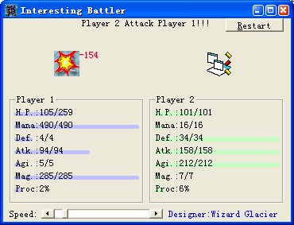

图标大战，2003年，VB6，第一款可互联网联网对战游戏，第一次使用图像处理算法计算图标的生命/攻击/防御

**简介**： 随便拖动两个文件到这里，让他们的图标打一场仗吧，慢慢欣赏这场古典式的战斗吧，这个软件还支持网络对战，将你选出来的图标勇士和你同伴的比一比吧。

**自我评价**：这是我高一时制作的小软件，是用来技术练习的，主要就是其中的联网对战部分。其中用了不少的API，不过这也是个经典游戏的，可惜不是我创意的，不过这也算是我的又一游戏作品了。

---
#### 精选评论

> 崔璨2012-07-29 10:36
>
> 这个感觉很萌:) 而且有微弱的相爱相杀奸情流动的感觉

> 梁爽2012-07-29 10:55
>
> 回复崔璨：这种都可以看出来啊，哈哈

> 崔璨2012-07-29 11:24
>
> 回复梁爽：想象一下PS在那边大喊：【大胆CorelDraw！居然敢动我家AI！看我不爆你菊花】【啪啪啪啪啪啪】 之类的就很萌~~~

> 张文哲2012-07-29 18:46
>
> 你俩有啥话能不能当面说呢？

> 梁爽2012-07-29 21:07
>
> 回复张文哲：叹气她今天上班去了
