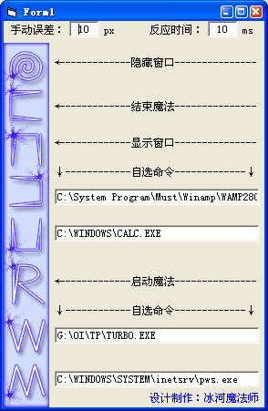

**简介**：最近一段时间在玩《黑与白》，我觉得它做的真的是太优秀了，其中施魔法那部分让我感到了好奇，它完完全全的就是一个鼠标轨迹识别系统，如果能够做在Windows下面那一定很眩了！我已经做出来了，现在您也试试？ 

**自我评价**：这是高一寒假时的作品，当时正好在玩《黑与白》这个游戏，对其中的魔法系统起了兴趣，于是简单的研究了一下，顺便做了这个小软件。

**适用范围展望**：有时候觉得这个其实很无聊，操作速度还不如打开快捷方式，但请注意，如果你想给别人看点东西，你并不想让别人知道你放在哪里的，这就派得上用场了，而且这个可以作为输密码的工具，一种特殊的密码，所以，发展前途是很广的哟！ 

