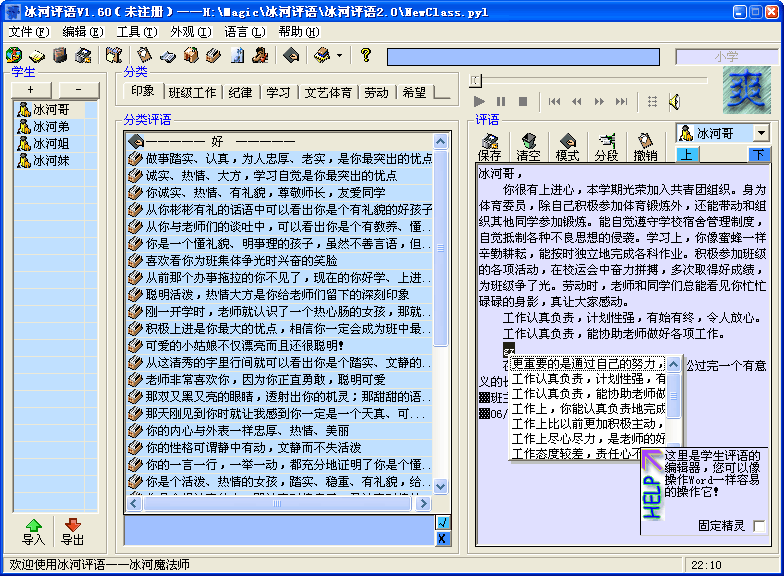

**简介**：冰河评语是一款专门为老师开发的评语编辑系统，每当期末来临，总是老师最累的时候，而这其中最麻烦的就是写评语，如果借助现代化的工具，那么这一定会使您的效率得到质的飞跃。

**技术要点**：打印，完全使用的API。超酷界面，自己开发的类实现的。输入区的输入提示，用代码实现的类IDE界面。数据库加解密，虽然表现不出来，但体现了一种保护数据安全的思想。

**自我评价**：这是我初二初学VB时开始制作的，从一个只有基本功能的软件，经过到高一为止的升级，变得已经非常的专业了，这是所有我的软件中费心血、花时间最多的，也是技术含量最大的，更是我最爱不释手的。里面融合了我最喜欢的三种奇异的加密技术，没什么特别的用途，完全是为了实践技术。

**获得的荣誉**：本软件在各大下载站中，在同类软件里总是名列前茅。曾经有位老师发信来感谢到“你真是中国园丁的好榜样，感谢你的软件”。在“中国中小学生电脑作品比赛”中获得重庆一等奖。在高一短短的一年里，就获得了注册用户三百多人。
