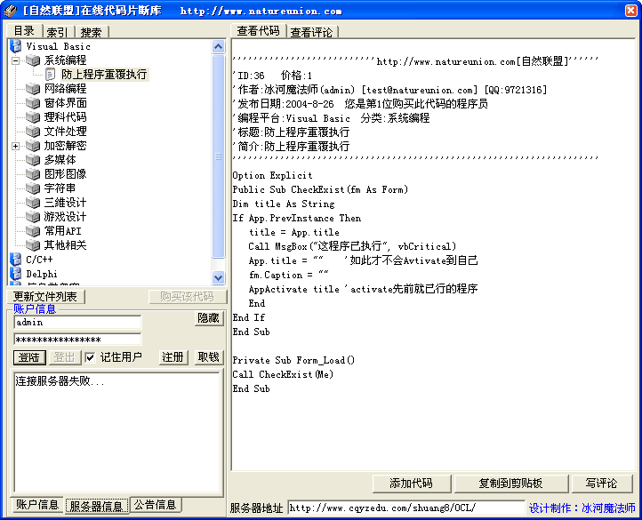

**简介**： 如果你是初学者，你可以通过这个软件查询到你需要的代码，以丰富你的程序，也省去网络搜索的痛苦，如果你是高手，你也可以通过加入自己的代码，来丰富这个软件，让广大的程序员获得更多的资源。同样，这个软件有很好的网上升级功能，可以很方便的获得最新资源，而且即使是离线状态，也可以查询已经下载下来的代码。

**自我评价**：这是我高二暑假时制作的，也就是在编这本专辑时制作的，是用来丰富我的课外生活的。这个项目是很早以前就打算了的，但由于各种原因，始终没能动工，而后来，只花了三天便制作出来，而且白天还是关在书房里看教科书，我自己对我自己的编码速度表示比较满意。
