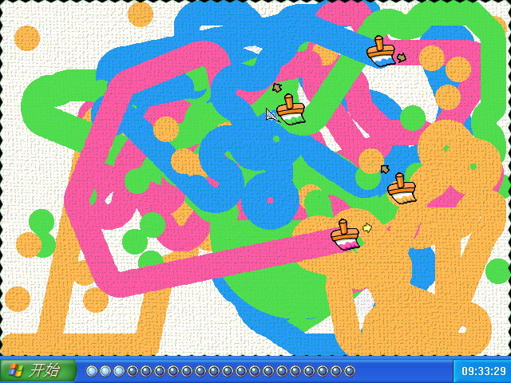

画笔大战，游戏素材提取自同名日本游戏，2004年初，三个月，VB6+GDI，使用教室电脑编制，
十分感谢当时在教室玩的同学给游戏改进提出的宝贵意见，也感谢老师对此行为的默许

**简介**：这是一款小巧别致的游戏软件，寓教于乐，在玩的过程中可以培养学生的时间观念和讲卫生的文明习惯。同时还可以树立学生的自信心和锻炼学生的意志力。在比赛中可以体现出现代学生永不甘落后的追求精神。

**游戏规则**：画笔大战是一款小巧的多人竞技游戏，通过控制使你的画笔在屏幕上移动，去吃道具，获得更加神奇的魔法功能，然后在一分钟内，尽可能多的使自己的颜色覆盖更多的地方，谁覆盖的面积最大，谁就是赢家。在单人闯关模式下，通过控制你的清洁工具将我们美丽的校园打扫得更加干净。但是你的时间很紧迫，所以你一定要抓紧，快行动吧！

**技术要点**：本程序完全使用API函数进行的图片显示，为得到很快的速度，专门进行了算法的优化。屏幕颜色面积计算使用了模糊计算方法取得了更好的效果。
自我评价：这是我高二时，认为自己已经完全精通VB时，用课余时间开发的。想出这个点子的时候，高兴好半天。这个玩法是我自己很喜欢的，充满童真。

---
#### 精选评论

> 钱多多 2008-03-04 11:58
>
> 最喜欢画笔大战
> \
> 高中就一大帮人中午就挤在讲台玩画笔大战
> \
> 现在到了大学还在继续给宿舍的传播,忽忽
> \
> 期待你的游戏

> 张演 2012-07-30 09:51
>
> 一直很怀念这个游戏哈哈
