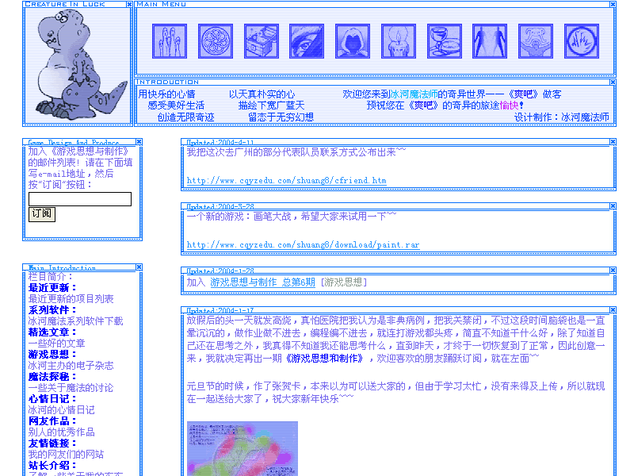

2000年5月17日，对我来说是一个意义重大的日子，因为从那天开始，我们家的电脑就连入互联网了，随后在六一儿童节那天放假的时候，在网上找到了我梦寐以求的免费空间——可以寄托我的梦的地方，随后使用了FrontPage，因为有使用Word的经验，所以FrontPage的上手对我来说十分容易，很快，第一版的网站出来了，内容和许多第一次做网站的朋友一样，都是提供一些网上的好东西来下载，不过我倒是算是比他们多一点点，还提供了我的程序的下载。当时什么都不懂的我当然也不会知道计数器这个东西，所以究竟有多少人上过我的那个网站也无从得知，但应该会是很少的吧？呵呵！

初二的寒假也算过得很有意义了吧，把我的网站晋升到“酷”这个档次了，不过也只是在网上闲逛时看到别人提供的网站模板，便下载下来修改了一下就成了，但是毕竟摆酷是很累的，的确，我花了好几天的时间才把这个庞大的图切成了一份一份的，再用JAVA语句嵌进去，累！不过这次的内容相比之下就更加丰富了，在网上收集的东西几乎全部都摆上来了，当然，把我最喜欢的天文博览放在了第一位了。这次的访问量大多了，平均每天五六十个IP，我也感到十分高兴，不仅仅是访问量大了，还因为有许多人下载我的软件，而且有人说，这么一位小朋友就能做到这个水平不错了，我知道别人是在赞赏我，但是我知道其中的潜台词就是这个做得还不行，所以之后我就决定不声张我的年龄，以至于后来竟有人以为我是一位年过四十的老教师。

初二暑假时，学会了聊天，一次，一位网友指出，用别人的模板做出来的网站有什么意思，当时我倒是很生气，不过还好，这种气愤转化成了一种动力，促使我自己亲自设计一个“酷”的网站，当时已经对PhotoShop很有兴趣的我正好找到了一个实践的机会，便用掉了我所知道的所有技术设计了一个酷酷的网站，鉴于上次做网站时的经验，便顺便开发了一个“神速切割”的软件，方便我的网站制作，事实证明，这真的达到了事半功倍的效果。正当我在担忧我的网站做得很差的时候，许多网友都认同了我的网站属于酷的那种。界面倒是好看多了，不过内容少了，因为受到上一位网友的刺激，我决定在我的网站上只放上我的原创的东西，可怜我那仅有的一点点，全都拿出来，还填不满一个网站。也因此，网站的访问率甚至还没有上一次好，但我觉得也算在意料范围内了，但是还是因为我的软件——冰河评语，还是吸引了大量的老师光临，为我提出了许多宝贵的意见，在此一并谢过了。

一直到了初三寒假，技术上的日益丰富，使我越来越看不惯自己的网站了，最后终于痛下决心，进行改版，这次由于学了些Java的缘故，使我可以自由的驰骋在HTML的代码中了，网页也得到了质的飞跃，但是由于当时正值迎接中考之时，初三的压力使我顾不过我的网站了，贫乏的内容使我失去大量的回头客，还好当时由于我创办的《游戏思想与制作》，在业余游戏届起了一点点小小的轰动，才使我的网站的访问率稳步上涨。一直到了中考之后，我才有机会继续改版，当然只是把内容进行了扩张，也因此认识了许多高手。其中最得意的还是那只憨厚可爱的小恐龙，那是我的第一张手绘+电脑上色的CG。

高一时，受到我们计算机老师的重点培养，因此也认识了不少的电脑高手，虽然我是其中唯一一个拥有网站的，但是我还是为我那个拿不出手的网站感到害羞，于是在高一暑假搞信息学奥赛的同时，做了第五版的我的网站，当然是我认为的最漂亮的，也是技术含量最高的，因为它是ASP制作的，用JavaScript+VBScript编制了许多的特效，也得到了我的同学们的广泛的好评。这次有了自己设计的留言簿，让我和访问者拉得更近了，得到了不少有益的反馈。

《火星探索》主题网站也是为了迎接“第五届全国中小学生电脑作品制作活动”而制作的，获得了重庆市一等奖，整个网站显得很清新，通底的纯色调，给人以整洁美，红色的主色调更能体现火星探索的主题。整个网站有不少由JS和VBS编成的特效，具有不小的学习价值。

初一暑假 第一版

初二寒假 第二版

初二暑假 第三版

初三寒假 第四版

高一暑假 第五版

高二寒假 《火星探索》主题网页

