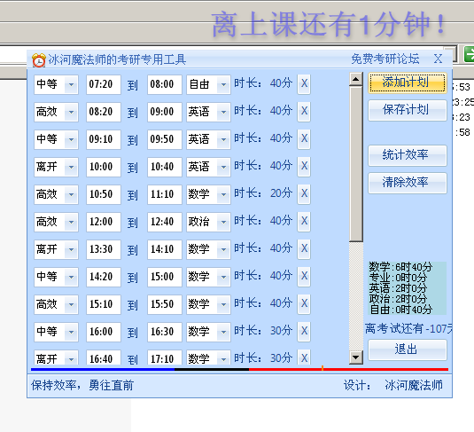

下载地址:[alerter.rar](download/alerter.rar)

# 软件介绍

是不是觉得考研很没效率？那就试试这款软件吧，安排好考研的计划，然后好好的按照提醒器进行执行吧。

具有定时打铃、统计学习时间、考验倒计时功能。
忘说了，为了方便在上课时间禁用了屏幕保护。

# 安装说明：
1. 本软件属于绿色软件，直接解压至任何地方均可运行。
2. 本软件需要.Net

需要[.Net 2.0](http://www.xdowns.com/soft/38/105/2006/Soft_33400.html)

# 更新内容
10月22日更新内容：
1. 美化界面
2. 在屏幕右上角显示当前课程
3. 增加学习进度条
4. 添加了到免费考研论坛的快捷方式

9月18日更新内容：
1. 增加打预备铃的功能
2. 将禁止屏幕保护放到菜单的选项中
3. 新增效率统计功能

