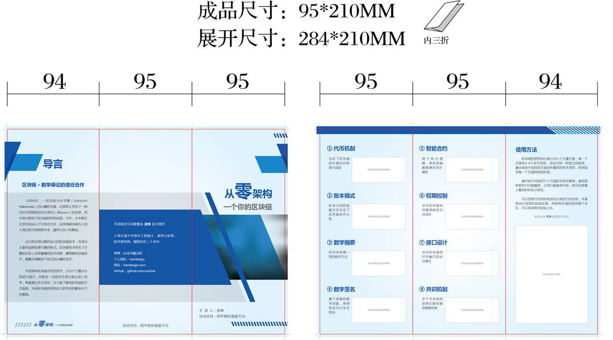
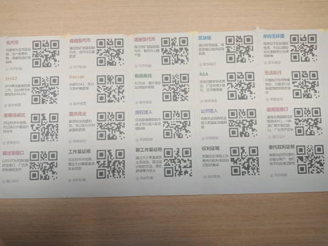
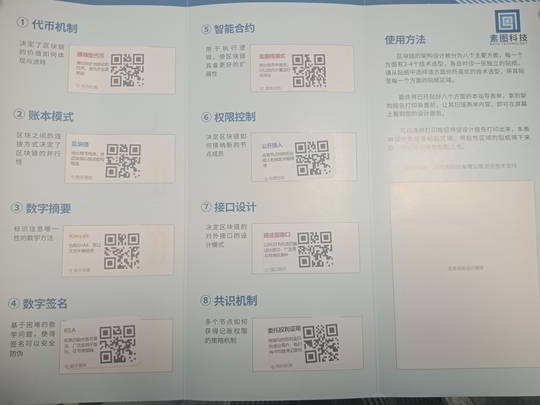
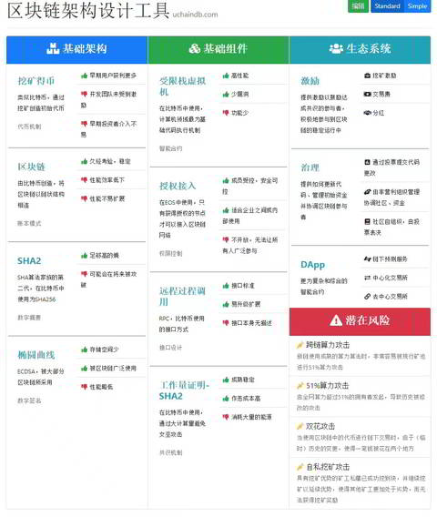

- 线上设计工具： https://b.uchaindb.com
- 前端代码： https://github.com/SutuLabs/ChainIntro
- 扫描器代码： https://github.com/SutuLabs/ChainIntroScanner

相关故事：

- [小朋友们的区块链探索之旅](../../../posts/2019/introduce-blockchain-to-child)