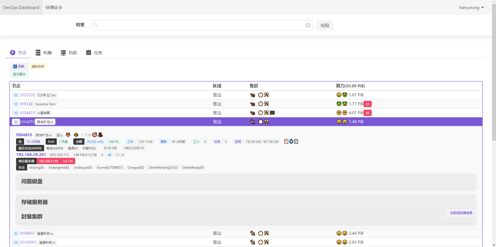
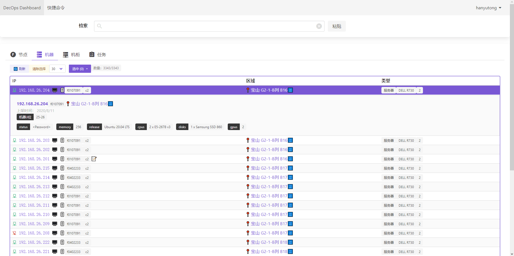
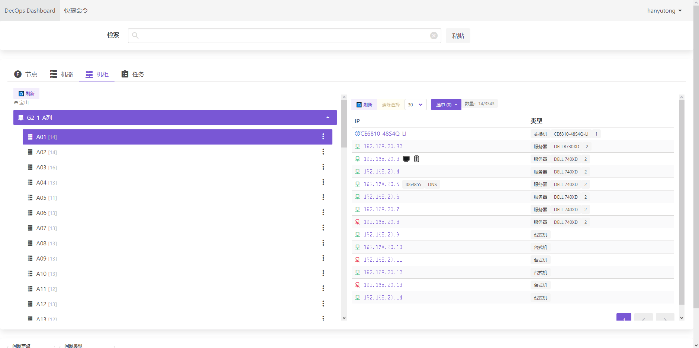

该产品应用在大规模区块链集群中，保障了超过3000台服务器，超过300PB存储容量的不间断服务，保证了区块链的安全运行

功能：

- 集群信息汇总查看
    - 实时运行数据采集
    - 批量命令执行
- 多维度检索机器及信息
    - 自动机器发现和配置
    - 机器历史故障记录关联
- 异常信息即时发现
    - 利用机器学习自动发现日志异常
    - 错误自动恢复及状态即时通知

