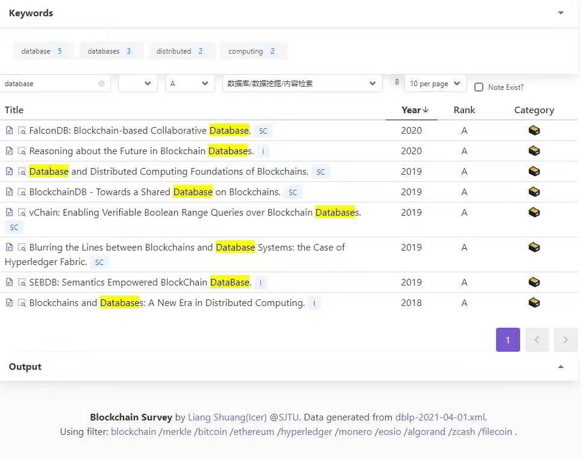
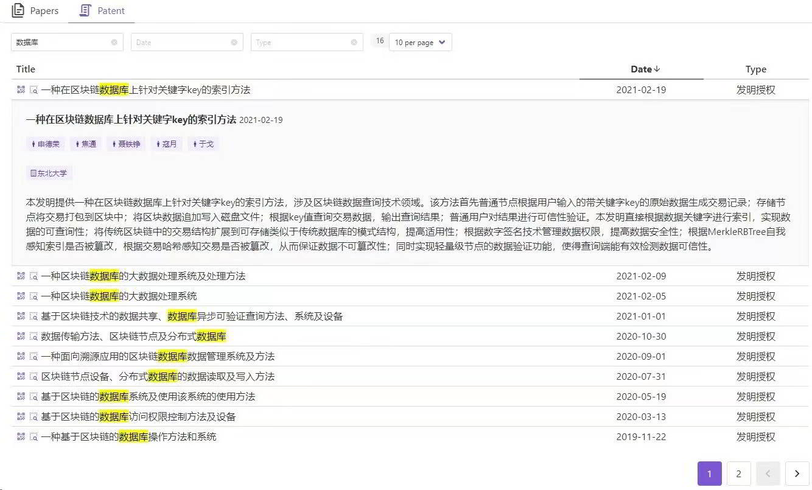
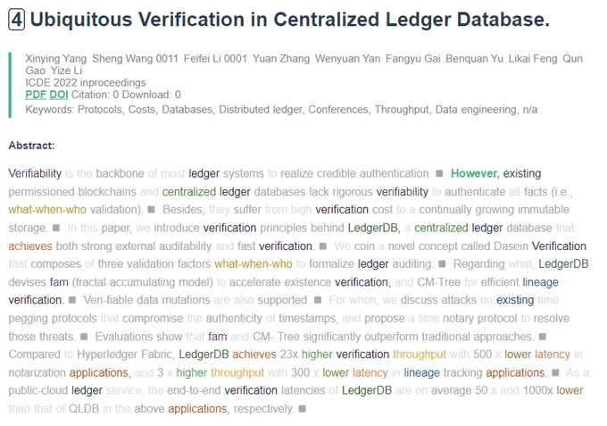

<!-- 2021-4-1 -->

> 做了一个做区块链文章调研的自用小工具，虽然我觉得对其他人可能用处不大，但是万一朋友圈有朋友可以告诉我，我这是在重复造轮子了并告诉我哪里有轮子用那就赚大了。

说明：文章全出自dblp，优势：1) 有CCF等级，且可筛选，2) 可以做笔记 3) 瞬搜 4) 热点关键字排名

也支持专利查询

- 网站地址： https://sutulabs.github.io/BlockchainSurvey/
- 代码地址： https://github.com/SutuLabs/BlockchainSurvey

还有一系列的工具：

- 网站地址： https://science.icerdesign.com/
- 代码地址： https://github.com/wizicer/ScienceTool